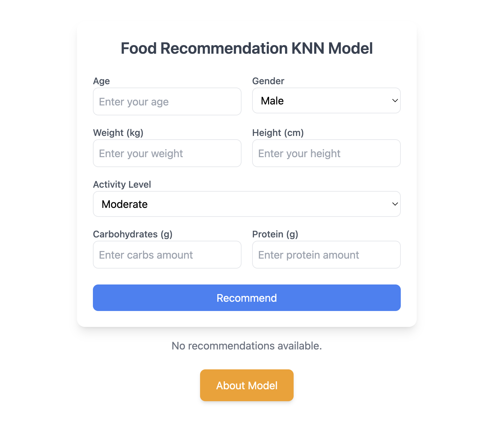
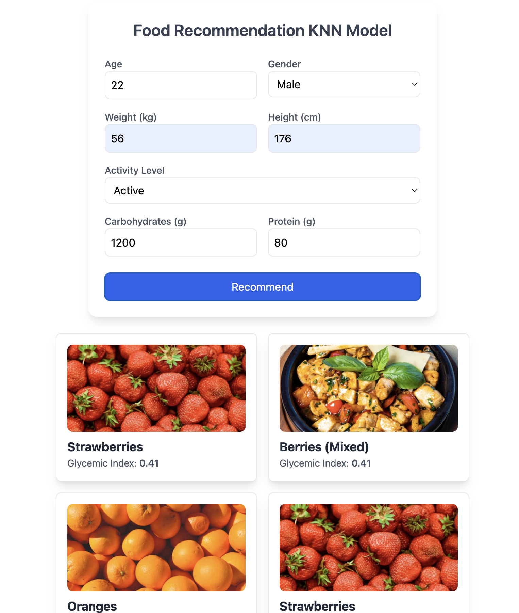

### 🥗 Food Recommendation System - Frontend

🚀 *Frontend ของระบบแนะนำอาหารสำหรับผู้ป่วยเบาหวาน*  
Frontend พัฒนาโดยใช้ *React + Vite* และ *Tailwind CSS* เพื่อสร้าง UI และเชื่อมต่อกับ API ของ *FastAPI* ที่รันบน Railway  

---

## 📌 *คุณสมบัติของโปรเจค*
✅ กรอกข้อมูลสุขภาพ เช่น อายุ, น้ำหนัก, ส่วนสูง, ระดับกิจกรรม  
✅ ส่งข้อมูลไปยัง Backend เพื่อรับคำแนะนำเกี่ยวกับอาหาร  
✅ แสดงรายการอาหารแนะนำพร้อม *Glycemic Index (GI)*  
✅ ค้นหารูปภาพอาหารจาก *Unsplash API* และแสดงผล  

---

## 🛠️ *เทคโนโลยีที่ใช้*
- *React + Vite* พัฒนา UI ที่โหลดเร็ว  
- *Tailwind CSS*  จัดการ UI   
- *Unsplash API* ค้นหารูปภาพอาหาร) 
- *FastAPI (Backend)* รองรับการประมวลผลโมเดล KNN  
- *Vercel Deploy Frontend*  
- *Railway Deploy Backend*  

---

### 📂 **โครงสร้างโปรเจค**
```sh
frontend/
├── public/
│   ├── favicon.ico
│   ├── index.html
├── src/
│   ├── components/
│   │   ├── FoodForm.jsx
│   │   ├── ResultCard.jsx
│   ├── App.jsx
│   ├── main.jsx
│   ├── index.css
├── .env
├── package.json
├── vite.config.js
├── README.md
```

---

## ⚙️ *การติดตั้งและใช้งาน*
### 🚀 *1. Clone Repo*
git clone https://github.com/your-username/food-recommendation-frontend.git
cd food-recommendation-frontend

### 🛠 *2. ติดตั้ง Dependencies*
npm install

### 🔑 **3. ตั้งค่า API URL ใน .env**
สร้างไฟล์ .env และเพิ่มค่า API URL ของ Railway  
env
VITE_API_URL=https://your-api-url.up.railway.app

### 🏃️ *4. รันโปรเจค*
npm run dev
👉 เปิดเบราว์เซอร์แล้วเข้าไปที่ http://localhost:5173 เเต่ละเครื่องจะไม่เหมือนกัน 

---

## 🚀 *Deploy ขึ้น Vercel*
### *ติดตั้ง Vercel CLI*
npm install -g vercel
### *Deploy โปรเจค*
vercel --prod
✅ ระบบจะแสดง URL เช่น  
✅ Production: https://food-recommendation.vercel.app

---

## 📸 *ตัวอย่าง UI*
| 📌 แบบฟอร์มกรอกข้อมูล | 📌 รายการอาหารแนะนำ |
|----------------------|----------------------|
|  |  |

---

## 📚 *API ที่ใช้*
📌 *Backend API (FastAPI)*
| Method | Endpoint            | คำอธิบาย               |
|--------|-----------------|------------------------|
| POST | /recommend    | รับข้อมูลสุขภาพและแนะนำอาหาร |
| GET  | /             | ตรวจสอบ API ว่าทำงานอยู่ |

📌 *Unsplash API หารูปภาพ*
ใช้ API ของ Unsplash เพื่อค้นหารูปภาพอาหาร  

---

## 🤖 *ปุ่ม "About Model"*
📌 ปุ่ม About Model เชื่อมไปที่ *Jupyter Notebook บน Binder*  
<button
  onClick={() =>
    window.open(
      "https://hub.2i2c-bare.mybinder.org/user/akkarinjb-notebook-food-recommen-jzkr4wc9/lab/tree/model3_matrix.ipynb",
      "_blank"
    )
  }
  className="px-6 py-3 bg-amber-500 text-white rounded-lg hover:bg-slate-900 transition shadow-md"
>
  About Model
</button>

---

## 🛠️ *TODO Feature ที่จะอาจจะเพิ่มในอนาคต*
- ✅ รองรับการแนะนำอาหาร 6 อย่าง  
- ✅ แสดงรูปภาพอาหารจาก Unsplash  
- 🔜 เพิ่มฟีเจอร์ *บันทึกเมนูโปรดของผู้ใช้*  
- 🔜 รองรับ *หลายภาษา*  

---

## 🤝*เครดิต**
- 🐹 *Frontend* โดย: [Aekarin](https://github.com/AkkarinJB)  
- 🐺 *Backend* โดย: [Aekarin](https://github.com/AkkarinJB/Food-API.git)  
- 📸 *API ภาพอาหาร* โดย: [Unsplash](https://unsplash.com/)  
- 🏡 *Deploy โดย* Vercel + Railway  

---
